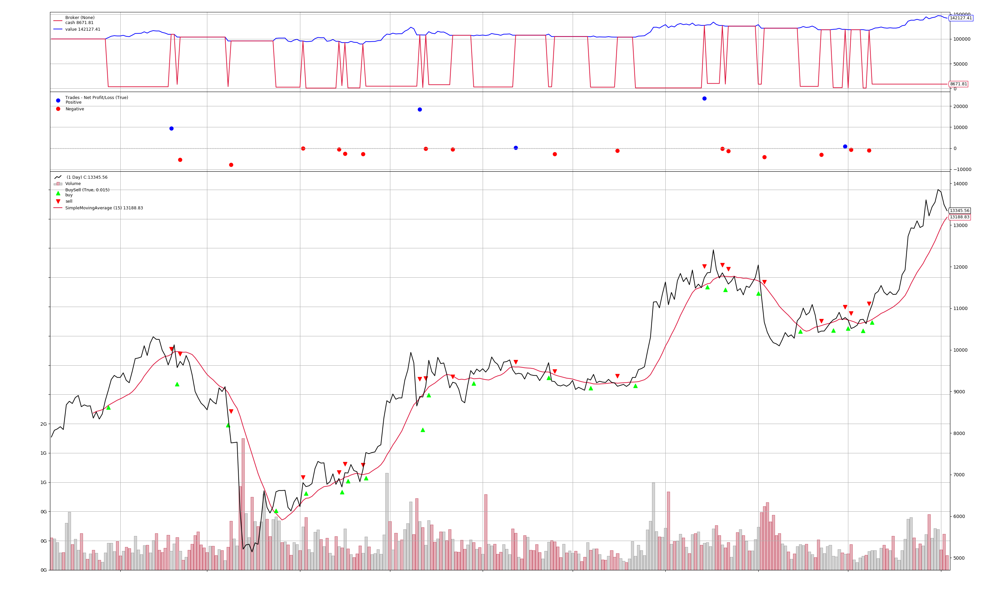

# SageMaker 比特币量化交易 Workshop

在这个 workshop 中，我们将通过火币 API 调取比特币的交易数据，并且尝试训练、调优一个机器学习模型来进行自动化交易。参与者将学会如何在 SageMaker 中进行模型训练，并且通过超参优化和回测选取最优的交易模型。

# 准备工作

在开始之前，建议在 AWS 东京区（ap-northeast-1）创建一台 SageMaker Notebook 实例，并且为实例所挂载的 AmazonSageMaker-ExecutionRole 附加一个 AmazonEC2ContainerRegistryFullAccess 的权限。接下来，就可以在 Jupiter 环境中将此实验的内容克隆并开始试验了。

# 实验步骤

您可以选择如下顺序进行实验：

## 1. Quickstart Guide

您可以通过这个 Notebook 中的实验快速熟悉如何使用 BackTrader 以及其工作逻辑。这个实验中将使用一个简单的 15 日均线策略进行交易。

## 2. Machine Learning Strategy Example

在这个实验中我们将组建和尝试训练一个简单机器学习模型，并且将其表现进行回测。

## 3. Hyperparameter Optimization

在这个实验中能够我们将第二个实验中组建的机器学习模型打包到一个 Docker 容器中，并且在 SageMaker 中运行一个超参优化任务。在得到理想的模型和超参组合之后，您可以尝试将模型代入到第二个实验环境中进行回测验证。